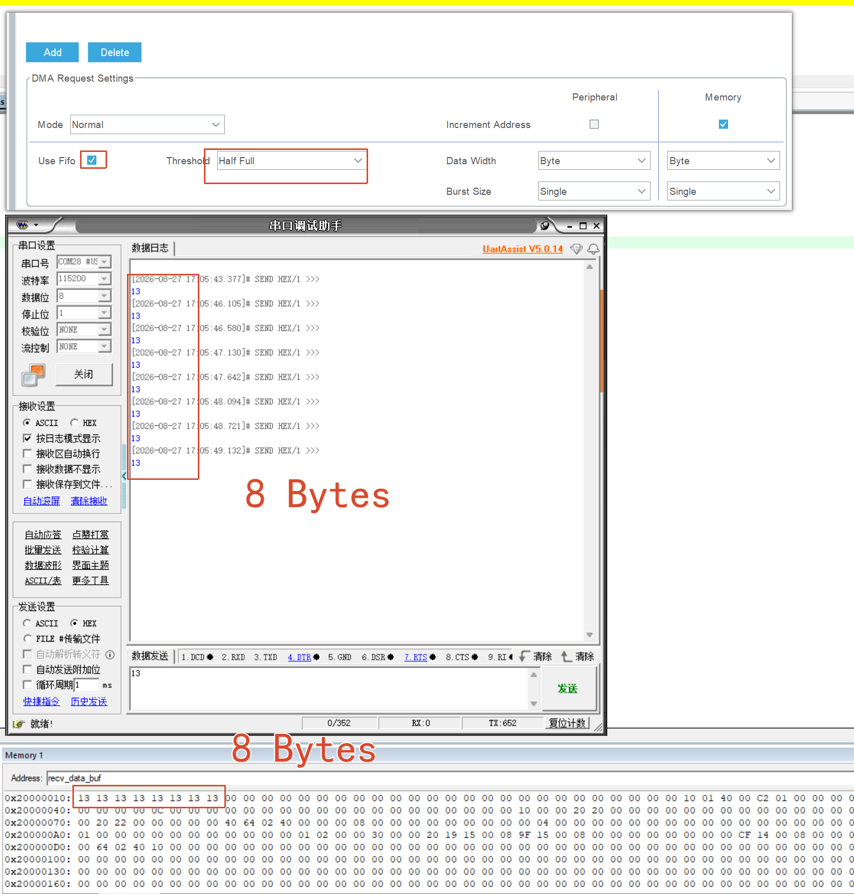
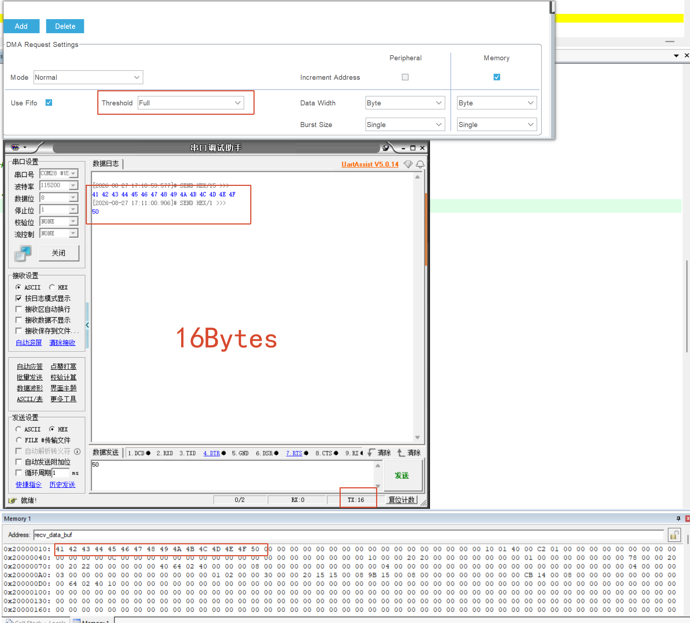
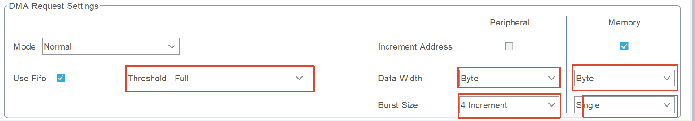

[简体中文](README_zh.md) | **English**

[](../LICENSE)

# STM32F411CEU6 USART DMA FIFO and Burst Transfer Experiment

## Project Overview

##### Introduction

This project is based on the STM32F411CEU6 and the HAL library. It uses USART1 DMA reception to observe how FIFO Threshold and Burst Size affect data transfers.

##### Key Features

- USART1 DMA data reception
- DMA FIFO Threshold comparison
- Peripheral and Memory Burst Size comparison
- Receive-buffer observation through the MDK Memory Window

##### Repository Structure

```text
Core/                  Core source files and headers
Drivers/               STM32 HAL and CMSIS drivers
MDK-ARM/               Keil MDK project
Docs/Images/            Experiment screenshots
STM32F411CEU6.ioc       STM32CubeMX configuration
README_zh.md            Chinese documentation
```

## Usage Guide

##### Environment and Dependencies

- STM32F411CEU6 development board
- 3.3 V USB-to-UART adapter and SWD debugger
- Keil MDK-ARM and STM32CubeMX

##### Hardware Connections and Configuration

| USB-to-UART | STM32F411CEU6 |
| ----------- | ------------- |
| TX          | PA10 (USART1_RX) |
| RX          | PA9 (USART1_TX)  |
| GND         | GND               |

UART settings: 115200 baud, 8 data bits, 1 stop bit, no parity, and no flow control.

##### Build, Run, and Observation

1. Open `MDK-ARM/STM32F411CEU6.uvprojx` in Keil, then build and download the program.
2. Run the program at full speed and send hexadecimal data using a serial terminal.
3. Pause the program and inspect `recv_data_buf` in the Memory Window.

##### Porting Notes

When porting, verify the USART pins, DMA Stream/Channel, system clock, and UART settings. FIFO capacity and supported Burst combinations may differ between devices; refer to the corresponding reference manual.

## Experiment Report

##### 1. Background and Principles

1. Determine the size of the DMA FIFO.
2. Determine the effects of different Burst Sizes.

##### 2. Hypothesis

None.

##### 3. Platform and Configuration

- STM32F411CEU6
- MDK

##### 4. Variables and Controls

###### Sub-experiment 1: Measuring FIFO Size

- Independent variable: FIFO Threshold
- Dependent variable: size of each update to the UART receive buffer
- Control variables: all other factors

###### Sub-experiment 2: Burst Size

- Independent variable 1: Peripheral Burst Size
- Independent variable 2: Memory Burst Size
- Dependent variable 1: number of AHB transfer groups required to move the 16-byte FIFO contents
- Dependent variable 2: number of consecutive reads of the same Peripheral Register
- Control variables: all other factors

##### 5. Experimental Procedure

None.

##### 6. Experimental Data, Analysis, and Conclusions

###### Sub-experiment 1: Measuring FIFO Size

1. Half Full and Full

   

| FIFO Threshold | Size of Each UART Receive-Buffer Update |
| -------------- | --------------------------------------- |
| Half Full      | 8                                       |
| Full           | 16                                      |

The test shows that the DMA FIFO size is 16 bytes.

###### Sub-experiment 2: Burst Size

1. How Memory Burst Size Moves FIFO Data

   Control conditions: FIFO Threshold is Full, Peripheral Burst Size is Single, and both Peripheral and Memory Data Width are one byte.

| Memory Burst Mode | Data per AHB Transfer Group | AHB Transfer Groups Required to Move 16 Bytes |
| ----------------- | --------------------------- | --------------------------------------------- |
| Single            | 1 byte                      | 16 groups                                     |
| INCR4             | 4 bytes                     | 4 groups                                      |
| INCR8             | 8 bytes                     | 2 groups                                      |
| INCR16            | 16 bytes                    | 1 group                                       |

2. Consecutive Reads of a Peripheral Register

   Control conditions: FIFO Threshold is Full, Memory Burst Size is Single, Peripheral and Memory Data Width are both one byte, and Peripheral Address Increment is disabled.

| Peripheral Burst Mode | Consecutive Reads of the Same Peripheral Register |
| :-------------------- | :------------------------------------------------: |
| Single                |                         1                          |
| INCR4                 |                         4                          |
| INCR8                 |                         8                          |
| INCR16                |                         16                         |

INCR4 is shown below: 

##### 7. Errors and Limitations

This experiment does not involve measurement accuracy, but it cannot directly observe the instantaneous AHB Burst process.

##### 8. Author's Reflections

1. Five Configuration Parameters



| Element | Function |
| ------- | -------- |
| FIFO Threshold | Determines how much data accumulates in the FIFO before writing to Memory |
| Peripheral Data Width | Determines how many bytes are read from the Peripheral each time |
| Memory Data Width | Determines how many bytes are written to Memory each time |
| Peripheral Burst Size | Determines how many consecutive reads are made from the Peripheral |
| Memory Burst Size | Determines how many consecutive writes are made to Memory |

These five settings can be represented using a producer-warehouse-consumer model:

**Peripheral (SRC) → FIFO (warehouse) → Memory (DST)**

   1. **FIFO Threshold**: Determines how much data must accumulate in the warehouse before delivery to the consumer begins. The total warehouse capacity remains unchanged; only the delivery trigger level changes.
   2. **Peripheral Data Width**: Determines the data unit read from the producer (`SRC`) each time, such as 1, 2, or 4 bytes.
   3. **Peripheral Burst Size**: Determines how many consecutive reads are performed from the producer (`SRC`) in each round.
   4. **Memory Data Width**: Determines the data unit written to the consumer (`DST`) each time, such as 1, 2, or 4 bytes.
   5. **Memory Burst Size**: Determines how many consecutive writes are performed to the consumer (`DST`) in each round.

2. FIFO Usage in Direct Mode and FIFO Mode

   - It is important to note that even when the FIFO is disabled, enabling DMA still causes one byte of data to be prefetched into an internal buffer. This allows the data to be transferred immediately when a request arrives, improving response time. 
   - When the FIFO is enabled, DMA preloads the entire 16-byte FIFO. When a request arrives, all the data is transferred in a single operation, providing efficiency close to that of an independent CPU operation. If there is insufficient data in RAM/SRAM—for example, only 13 bytes—the DMA still attempts to transfer 16 bytes, which may cause an exception. 

## License

This project is licensed under the **MIT License**.

Copyright (c) 2026 JesMicro. See [LICENSE](../LICENSE) for the complete license text.
