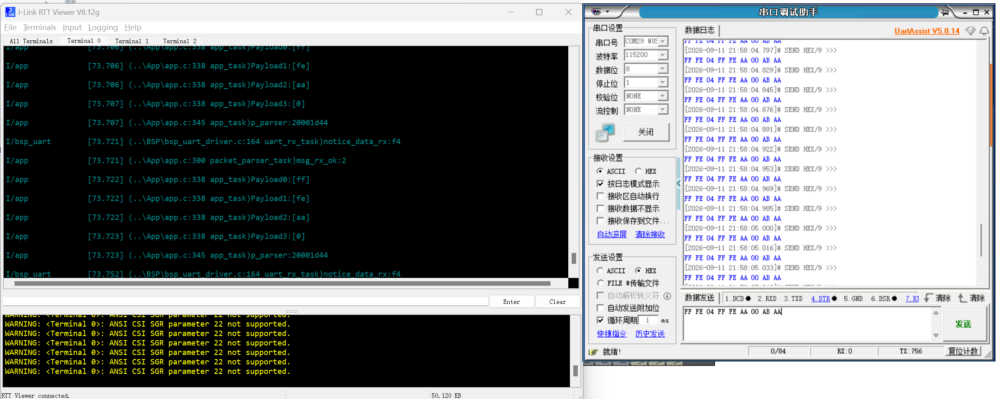

**English** | [简体中文](README_zh.md)

# STM32F411 UART Double-Buffer Frame Parsing Demo

## Project

##### Overview

This STM32F411CEU6 and FreeRTOS project implements interrupt-driven UART reception, two circular buffers, and frame parsing.

##### Features

- Alternating receive buffers with queue notifications.
- State-machine validation of headers, length, payload, checksum, and tail.
- Queue delivery of valid payloads to the application task.

##### Layout

```text
App/                                  Frame parser and application task
BSP/                                  UART double-buffer reception
Middlewares_User/circular_buffer/     Circular buffer
Core/                                 STM32 initialization
MDK-ARM/STM32F411CEU6.uvprojx         Keil project
```

## Usage

##### Requirements

- STM32F411CEU6 at 100 MHz
- Keil MDK 5 with ARM Compiler 5.06
- FreeRTOS / CMSIS-RTOS2
- USB-to-UART adapter, J-Link, and RTT Viewer

##### Wiring and Configuration

| USB-to-UART | STM32F411 |
|---|---|
| TX | PA10 / USART1_RX |
| GND | GND |

UART: `115200-8-N-1`, no hardware flow control.

Frame format:

```text
FF FE | LEN | DATA[LEN] | CHECK | AA
```

`LEN` is 1–100. `CHECK` is the low byte of `LEN + DATA`.

Each receive operation reads 9 bytes; each circular buffer holds 108 bytes.

##### Build, Run, and Observe

1. Open `MDK-ARM/STM32F411CEU6.uvprojx` in Keil, build, and flash.
2. Send `FF FE 04 01 02 03 04 0E AA` over UART.
3. View parsed payloads in RTT Viewer.

##### Porting

- Change UART and pins in `Core/Src/usart.c`.
- Change the receive size in `BSP/bsp_uart_driver.c`.
- Keep the buffer size divisible by the receive size.
- Change the frame format and checksum in `App/app.c`.

## Author's Notes

##### Project Notes

- Requirements Analysis and Business Flow


Source file: [01_串口私有协议：显示双缓冲+本地解包_需求分析与业务流向.drawio](Docs/01_串口私有协议：显示双缓冲+本地解包_需求分析与业务流向.drawio)

- Software Resource Architecture


Source file: [02_串口私有协议：显示双缓冲+本地解包_软件资源架构.drawio](Docs/02_串口私有协议：显示双缓冲+本地解包_软件资源架构.drawio)

- Program Analysis


Source file: [03_串口私有协议：显示双缓冲+本地解包_程序分析.drawio](Docs/03_串口私有协议：显示双缓冲+本地解包_程序分析.drawio)

##### Test Results



In actual testing, the system sustained one frame per millisecond and successfully parsed and identified abnormal frames, including frame-header errors, frame-tail errors, data errors, invalid data lengths, and checksum errors.

This experiment did not run any other real application tasks; only the three data-processing tasks were active. Therefore, the result should not be considered representative.

##### Other Notes

None.

## License

This project is licensed under the **MIT License**.

Copyright (c) 2026 JesMicro. See [LICENSE](LICENSE).
