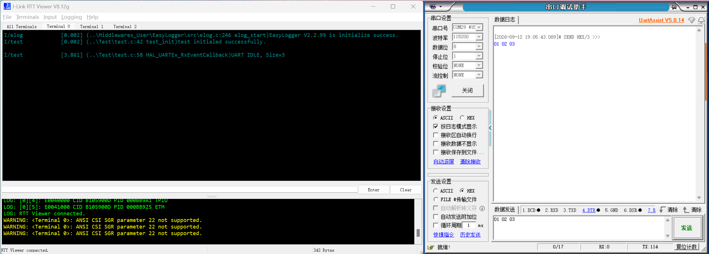
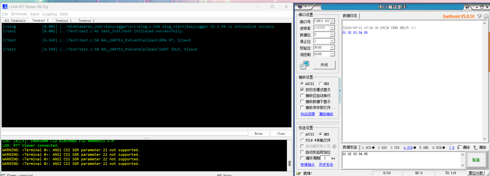
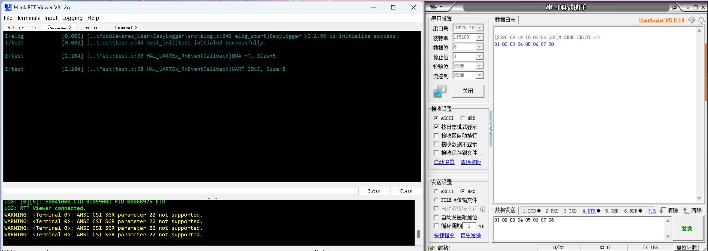
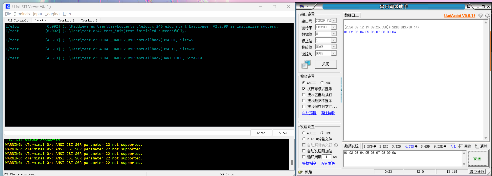
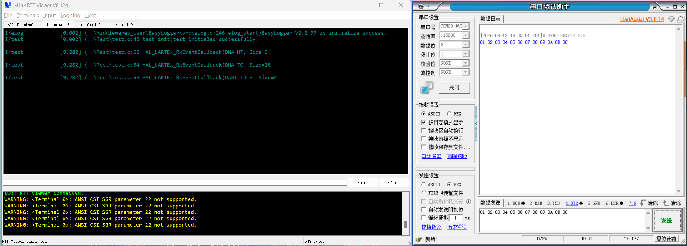
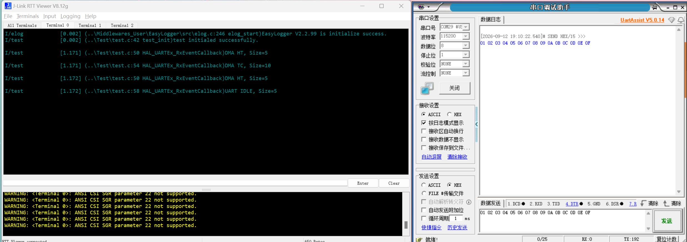
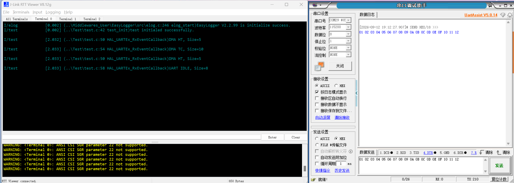
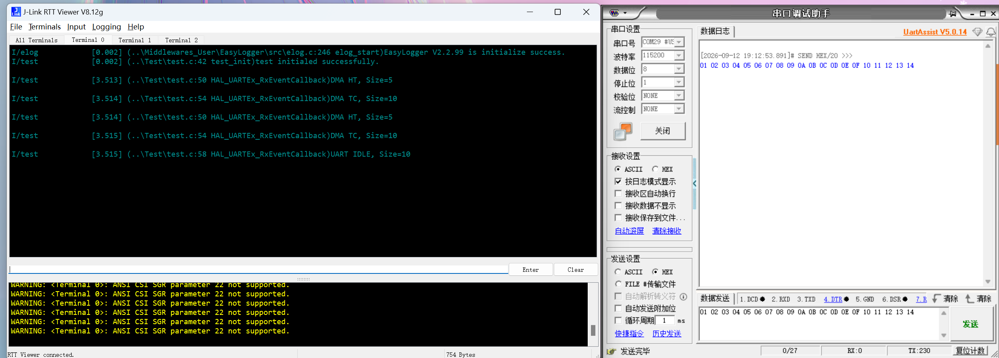
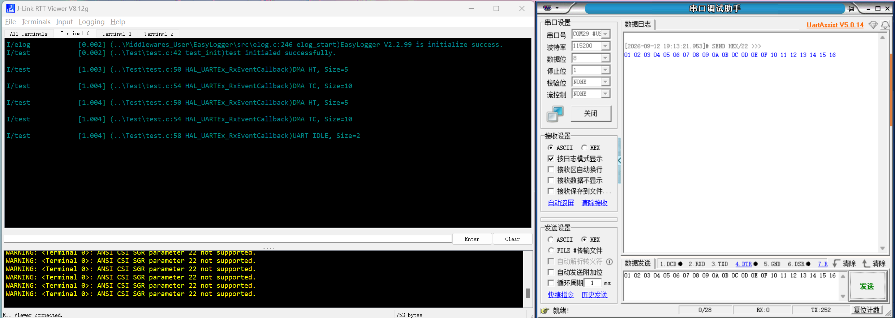

**简体中文** | [English](README.md)

[](LICENSE)

# STM32F411CEU6 UART DMA 循环接收 HT/TC/IDLE 事件实验

## 项目说明

### 项目简介

本工程用于验证 STM32F411CEU6 在 UART Receive-to-Idle 与循环 DMA
接收模式下，HT、TC 和 IDLE 事件的触发规律及回调参数。

### 主要功能

- 使用 `HAL_UARTEx_ReceiveToIdle_DMA()` 启动 USART1 循环 DMA 接收。
- 使用 10 字节缓冲区测试 HT、TC 和 IDLE 事件。
- 通过 EasyLogger 和 SEGGER RTT 输出事件类型及 `Size`。
- 在 FreeRTOS 测试任务中启动接收。

### 仓库结构

```text
Test/                         UART DMA 实验代码
Core/                         STM32CubeMX 初始化及中断代码
Docs/Images/                  实验截图
Middlewares_User/EasyLogger/  EasyLogger 日志组件
Middlewares_User/SEGGER_RTT/  SEGGER RTT 日志输出
MDK-ARM/                      Keil 工程文件
```

## 工程使用指南

### 环境与依赖

| 项目 | 配置 |
| --- | --- |
| MCU / 主频 | STM32F411CEU6 / 100 MHz |
| IDE / 编译器 | Keil MDK 5 / ARM Compiler 5 |
| RTOS | FreeRTOS（CMSIS-RTOS V2） |
| 日志 | EasyLogger 2.2.99 / SEGGER RTT 8.12g |
| 调试工具 | J-Link、RTT Viewer、串口调试助手 |

### 硬件连接与配置

| 项目 | 配置 |
| --- | --- |
| USART1 TX / RX | PA9 / PA10 |
| 串口参数 | 115200、8N1、无流控 |
| USART1 RX DMA | DMA2 Stream2、Channel 4、Circular |
| DMA 缓冲区 | 10 字节 |
| 接线 | USB 转串口 TX 接 PA10，并与开发板共地 |

### 编译、运行与观测

1. 使用 Keil 打开 `MDK-ARM/STM32F411CEU6.uvprojx`，编译并下载。
2. 使用 J-Link RTT Viewer 连接开发板并打开 Terminal 0。
3. 串口工具选择 HEX 发送，关闭自动追加回车换行。
4. 每组测试前复位开发板，发送指定长度的数据并记录日志。

### 移植说明

移植时需修改 UART 句柄、GPIO、DMA Stream/Channel 和中断配置，并保持
DMA 为 Circular 模式。缓冲区长度变化后，应同步调整 HT、TC 和 `Size`
位置的判断。

## 实验报告

### 1. 实验背景与原理

在开启 DMA + UART 空闲接收的条件下，单次发送不同长度的数据，观察其对
DMA 半满中断、DMA 全满中断和串口空闲中断的影响，为后续计算环形缓冲区
的 head、tail 提供数据依据。

### 2. 实验假设

无

### 3. 实验平台与配置

开启 DMA 和 UART 接收，并使用 `HAL_UARTEx_ReceiveToIdle_DMA()` 启动
空闲接收。

### 4. 变量与控制条件

- 自变量：单次发送数据的长度
- 因变量：HT、TC、IDLE 产生的次数以及 `Size` 大小
- 控制变量：其它所有因素。

### 5. 实验步骤

保持其他条件不变，每次发送不同长度的数据并记录 HT、TC、IDLE 的次数。
每组测试结束后复位系统，再进行下一组测试。发送长度分为：

1. 小于缓冲区一半长度
2. 等于缓冲区一半长度
3. 大于缓冲区一半长度且小于缓冲区总长度
4. 等于缓冲区总长度
5. 大于缓冲区总长度

### 6. 实验数据、分析与结论

缓冲区大小：10 字节。每组数据均为单次连续发送，并在测试前复位系统，使 DMA 从缓冲区起始位置开始接收。

| 测试编号 | 数据长度分类（本次选值） | HT 次数 | TC 次数 | IDLE 次数 | 回调顺序（包含事件类型和 Size） |
| :---: | :---: | :---: | :---: | :---: | :--- |
| 1 | 1～4（选 3 字节） | 0 | 0 | 1 | IDLE(Size=3) |
| 2 | 5 字节 | 1 | 0 | 1 | HT(Size=5) → IDLE(Size=5) |
| 3 | 6～9（选 8 字节） | 1 | 0 | 1 | HT(Size=5) → IDLE(Size=8) |
| 4 | 10 字节 | 1 | 1 | 1 | HT(Size=5) → TC(Size=10) → IDLE(Size=10) |
| 5 | 11～14（选 12 字节） | 1 | 1 | 1 | HT(Size=5) → TC(Size=10) → IDLE(Size=2) |
| 6 | 15 字节 | 2 | 1 | 1 | HT(Size=5) → TC(Size=10) → HT(Size=5) → IDLE(Size=5) |
| 7 | 16～19（选 18 字节） | 2 | 1 | 1 | HT(Size=5) → TC(Size=10) → HT(Size=5) → IDLE(Size=8) |
| 8 | 20 字节 | 2 | 2 | 1 | HT(Size=5) → TC(Size=10) → HT(Size=5) → TC(Size=10) → IDLE(Size=10) |
| 9 | 21～24（选 22 字节） | 2 | 2 | 1 | HT(Size=5) → TC(Size=10) → HT(Size=5) → TC(Size=10) → IDLE(Size=2) |

实验截图：

1. 测试 1：发送 3 字节（1～4 字节类）

   

2. 测试 2：发送 5 字节

   

3. 测试 3：发送 8 字节（6～9 字节类）

   

4. 测试 4：发送 10 字节

   

5. 测试 5：发送 12 字节（11～14 字节类）

   

6. 测试 6：发送 15 字节

   

7. 测试 7：发送 18 字节（16～19 字节类）

   

8. 测试 8：发送 20 字节

   

9. 测试 9：发送 22 字节（21～24 字节类）

   

**结论：**

在 Circular DMA 模式下，回调中的 `Size` 表示 DMA 在当前缓冲区周期内
的写入结束位置，而不是本次新增的数据长度。设缓冲区长度为
`UART_RX_BUFFER_SIZE`：

- DMA 写到缓冲区一半时产生 HT，
  `Size = UART_RX_BUFFER_SIZE / 2U`。
- DMA 写满整个缓冲区时产生 TC，`Size = UART_RX_BUFFER_SIZE`。
- 停止发送后产生 IDLE，`Size` 为当前缓冲区周期内的写入结束位置；
  写满一圈时 `Size = UART_RX_BUFFER_SIZE`。
- DMA 下一次写入位置为：

```c
head = Size % UART_RX_BUFFER_SIZE;
```

后续处理数据时，需要结合上一次位置计算新增数据，不能直接累加 `Size`。

### 7. 误差与局限性

日志在中断回调中输出，可能增加中断执行时间。本结论基于 10 字节缓冲区、
当前 HAL 版本和单次手动发送，其他配置需要重新验证。

### 8. 作者思考

了解了 HT、TC、IDLE 的产生条件以及回调中 `Size` 的含义。

## 许可证

本项目采用 **MIT License** 开源许可证。

Copyright (c) 2026 JesMicro。完整条款请参阅根目录的 [LICENSE](LICENSE) 文件。
